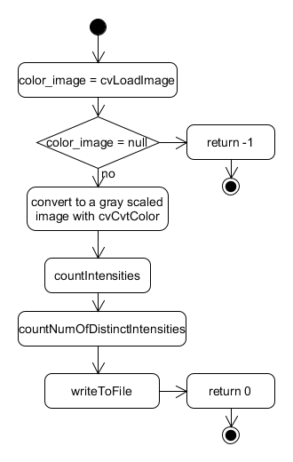
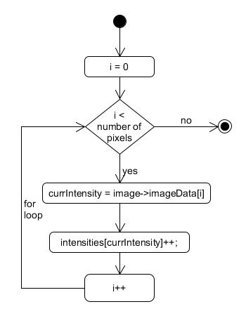
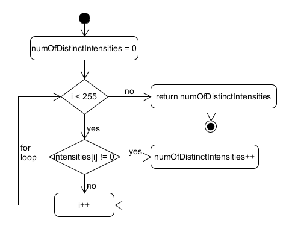

<div align="right">
    <p>04/18/2019</p> 
<p>Armandas Rokas (s185144) 
</p>
</div>
</br>
</br>
</br>
</br>

<center><h1>
    C assignment 3
    </h1> 
    PROBLEM 2: Histogram of my camera image
    </p></center>


</br>
</br>
</br>
</br>

</br>

**Table of contents**

- [Intro](#intro)
- [Main](#main)
- [Difficulties converting a picture to gray scaled](#difficulties-converting-a-picture-to-gray-scaled)
- [Counting the number of pixels of given intensity](#counting-the-number-of-pixels-of-given-intensity)
- [Counting the number of different intensities](#counting-the-number-of-different-intensities)
- [Writing HISTOGRAM.SOL file](#writing-histogramsol-file)
- [Acceptance testing](#Acceptance-testing)
- [Conclution](#conclution)


 <div style="page-break-after: always;"></div>


## Intro

This document  describes the implementation of "Histogram of my camera image" solution. 

## Main

First, the `main` function loads an image with `cvLoadImage` function by passing the name of the picture as an argument which was passed as the first parameter when the program was started. If it succeeds and the image is not null, so the image is converted to a gray-scaled image with `cvCvtColor` function. 

Next, there are called `countIntensities`, `countNumOfDistinctIntensities` ,`writeToFile` functions respectively with corresponding arguments. 


 <div style="page-break-after: always;"></div>
## Difficulties converting a picture to gray scaled

While there was trying to convert en image to grayscaled with cvCvColor at first place, `Assertion failed` error was occured, which is placed below:

```
OpenCV Error: Assertion failed (dst.data == dst0.data) in cvCvtColor, file /build/opencv-U1UwfN/opencv-2.4.9.1+dfsg1/modules/imgproc/src/color.cpp, line 4422
terminate called after throwing an instance of 'cv::Exception'
  what():  /build/opencv-U1UwfN/opencv-2.4.9.1+dfsg1/modules/imgproc/src/color.cpp:4422: error: (-215) dst.data == dst0.data in function cvCvtColor

Aborted
```

After some research was found that:

> CV_BGR2GRAY expects the destination to be a single channel, and not triple

So the solution was to create an extra image, which has one channel and give that image as destination :

```c
    IplImage* color_image = cvLoadImage(argv[1], CV_LOAD_IMAGE_COLOR);  // color image CV_LOAD_IMAGE_COLOR
    IplImage* image = cvCreateImage(cvGetSize(color_image), 8, 1);
    cvCvtColor(color_image, image, CV_RGB2GRAY );
```

References:
<https://stackoverflow.com/questions/9211696/opencv-assertion-failed-dst-data-dst0-data-in-cvcvtcolor>

 <div style="page-break-after: always;"></div>
## Counting the number of pixels of given intensity

The function called `countIntensities` counts the number of pixels of given intensity. The function takes two parameters. 

The first is an address of the array, where each element represents an intensity. The size of the array is `256`, because intensities is in the range between `0` and `255`,   where `255` is total white and `0` is total black.

The second parameter is the address of an image, which should be examined. 

The function simply loops all pixels and increments an element in the array, which represents the current intensity of the pixel.


 <div style="page-break-after: always;"></div>
## Counting the number of different intensities

The function called `countNumOfDistinctIntensities` counts the number of different intensities. 

At the beginning of the function, there is initiating the  `numOfDistinctIntensities` variable and is set to 0. Then the function loops all elements in the intensities array and checks if the number of an element is different from 0. If yes, so the value of `countNumOfDistintctIntensities` is incremented by one.  


 <div style="page-break-after: always;"></div>
## Writing HISTOGRAM.SOL file

The function, which is called `writeToFile` makes all work related to writing a Histogram.sol file.  Firstly, it opens the `HISTOGRAM.SOL` file with `fopen` function with mode `w`, which means that the function opens the file for overwriting and deletes the old content if it exists.  And then simply writes the desired information to file with `fprintf` function. 


 <div style="page-break-after: always;"></div>
## Acceptance testing

The program was tested with different pictures e.g. an all black, an all white and a colored pictures to prove that the program functions as it expected. All test is passed. 

## Conclusion

In spite of the fact that there was some problem with the cvCvColor function, the main goal to write a histogram file of an image was achieved, because the program worked as expected in acceptance testing.

In general, the task was very interesting, because I learned how to access a picture data and examine pixels values.  So I satisfied both on the result of the program and the learning process.  