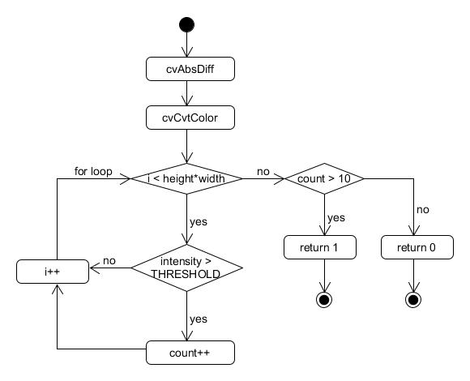

<div align="right">
    <p>04/18/2019</p> 
<p>Armandas Rokas (s185144) 
</p>
</div>
</br>
</br>
</br>
</br>

<center><h1>
    C assignment 4
    </h1> 
<p>Rapport animal activity in forest - recording animal activity with us of Raspberry Pi Camera </p></center>


</br>
</br>
</br>

**Table of contents**

- [Intro](#intro)
- [Main function](#main-function)
- [Detect movement](#detect-movement)
- [Rapport time and date](#rapport-time-and-date)
- [Saving a picture](#saving-a-picture)
- [Acceptance testing](#acceptance-testing)
- [Conclusion](#conclusion)

</br>

</br>

## Intro

This document describes the implementation of "Rapport animal activity in forest - recording animal activity with us of Raspberry Pi Camera " solution. 

## Main function

First, the main function uses `cvCaptureFromCAM` to capture a video from `RaspberryPi` camera. 

After that there are making two frames (the current frame and the previous frame) by cloning the current frame with `cvCloneImage` function.  These two frames is compared with `compareImages` function described below. 

If there a difference in the frames, the function checks if there are more than 4 sec from the last recorded activity with `diffTime` function. If yes, so the time is registered and logged in the text file with `logTxt` function and a picture is saved with `logJpg` function.


## Detect movement

Firstly, the function finds the difference between pictures with  `cvAbsDiff` function from `openCv` library.  Next, the resulting picture is converted to grayscale with `cvCvtColor` function in order to facilitate an examination of the picture, because in this way every pixel will have only intensities between 0 and 255. 

After that, every pixel is checked if it has more intensity than the user-defined `THRESHOLD` constant.  If yes,  it adds 1 to `count` variable. The count variable is used to minimize the chance of reporting the false movement.   



## Rapport time and date

When the movement is detected it has to be logged in a text file. It has been done by opening file for appending with `fopen` function using an `a+` mode. There was used `sprintf` to combine the file name string with a current date. Finally, there is used `fprintf` for writing to the file. 

```C
void logTxt(struct tm * timeinfo){
        static const char mon_name[][4] = {
        "JAN", "FEB", "MAR", "APR","MAY", "JUN",
        "JUL", "AUG", "SEP", "OCT", "NOV", "DEC"};
    
        FILE * cfPtr;
        char * file_name = (char *) malloc(15*sizeof(char));
        int year = timeinfo->tm_year + 1900;
        sprintf(file_name, "log%d%s.txt", year, mon_name[timeinfo->tm_mon]);
        if ((cfPtr = fopen(file_name, "a+")) == NULL){
                printf("File could not be opened");
                exit(1);
        }
        fprintf(cfPtr, "%d-%02d-%02d %02d:%02d:%02d\n",
                        year,
                        timeinfo->tm_mon+1,
                        timeinfo->tm_mday,
                        timeinfo->tm_hour,
                        timeinfo->tm_min,
                        timeinfo->tm_sec);
        free(file_name);
        fclose(cfPtr);
}
```

## Saving a picture

In order to save the picture is used `cvSaveImage` function.  `sprintf` combines a file name string and a text information string that is used to embed into a picture.

`cvPutText` puts the text on the picture with defined `color` in `CvScaler` and `base_font` in `CvFont`.  It is important to notice here that there is making a clone of the original picture and the text is put on the clone in order to not affect the original picture. It's has been implemented like this, because if the text is put on the original picture,  it could affect the next comparison and the text will be calculated as a difference in the pixels, which is not desired.  

```C
void logJpg(struct tm * timeinfo, IplImage * image){

        CvScalar color;
        CvFont base_font;
        color = CV_RGB(36,0,250);
        cvInitFont( &base_font, CV_FONT_HERSHEY_SIMPLEX, 1.5, 1.5, 0, 1, 8);

        char * currTime = (char *) malloc(19*sizeof(char));
        sprintf(currTime, "%d-%02d-%02d %02d:%02d:%02d",
                        timeinfo->tm_year+1900,
                        timeinfo->tm_mon+1,
                        timeinfo->tm_mday,
                        timeinfo->tm_hour,
                        timeinfo->tm_min,
                        timeinfo->tm_sec);

        IplImage * edited_image = cvCloneImage(image);
        cvPutText(edited_image, currTime, cvPoint(10, 400), &base_font, color);

        char * file_name = (char *) malloc(23*sizeof(char));
        sprintf(file_name, "%s.jpg", currTime);

        cvSaveImage(file_name, edited_image, 0);

        cvReleaseImage(&edited_image);
        free(currTime);
        free(file_name);
}
```

 <div style="page-break-after: always;"></div>

## Acceptance testing

The accepantce test was made indoors (not in a forest), where was trying to detect a dog's activity from maximum 5 meters. The program was up and running for 10 hours without any problems or crashes.  It took also only very few wrong pictures, where was not a movment that took a place, but there was some changes in the lightning og similar.


## Conclusion

The main goal to detect and record the activity was achieved. The program works like  it's expected, however it's only tested indoors. 