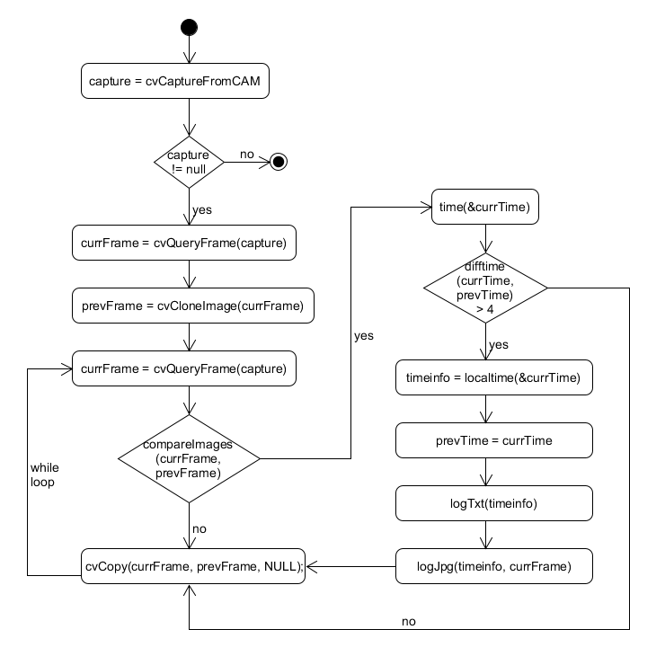
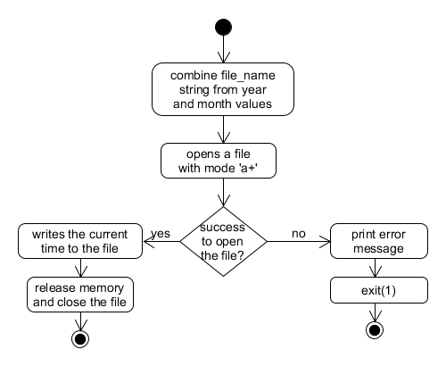
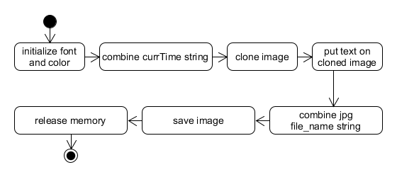

<div align="right">
    <p>04/18/2019</p> 
<p>Armandas Rokas (s185144) 
</p>
</div>

</br>
</br>
</br>
</br>

<center><h1>
    C assignment 4
    </h1> 
<p>Rapport animal activity in forest - recording animal activity with us of Raspberry Pi Camera </p></center>


</br>
</br>
</br>

**Table of contents**

- [Intro](#intro)
- [Main function](#main-function)
- [Detect movement](#detect-movement)
- [Rapport time and date](#rapport-time-and-date)
- [Saving a picture](#saving-a-picture)
- [Debugging with conditional compilation](#debugging-with-conditional-compilation)
- [Acceptance testing](#acceptance-testing)
- [Conclusion](#conclusion)

</br>

</br>

## Intro

This document describes the implementation of "Rapport animal activity in forest - recording animal activity with us of Raspberry Pi Camera " solution. 

## Main function

First, the main function uses `cvCaptureFromCAM` to capture a video from `RaspberryPi` camera. 
After that there are making two frames (the current frame and the previous frame) by cloning the current frame with `cvCloneImage` function.  These two frames is compared with `compareImages` function described below. 
If there a difference in the frames, the function checks if there are more than 4 sec from the last recorded activity with `diffTime` function. If yes, so the time is registered and logged in the text file with `logTxt` function and a picture is saved with `logJpg` function. 





## Detect movement

Firstly, the function finds the difference between pictures with  `cvAbsDiff` function from `openCv` library.  Next, the resulting picture is converted to grayscale with `cvCvtColor` function in order to facilitate an examination of the picture, because in this way every pixel will have only intensities between 0 and 255. 

After that, every pixel is checked if it has more intensity than the user-defined `THRESHOLD` constant.  If yes,  it adds 1 to `count` variable. The count variable is used to minimize the chance of reporting the false movement.   


## Rapport time and date

When the movement is detected it has to be logged in a text file. It has been done by opening file for appending with `fopen` function using an `a+` mode.

The biggest challenge here was to find out how to construct a string for a file name, because it should be constructed from a year, a month and .txt at the end. After some research there was found `sprintf` function that allows to combine strings and numbers to one string. 

Finally, there is used `fprintf` for writing to the file. 



## Saving a picture

In order to save the picture is used `cvSaveImage` function.  There was used again `sprintf` function to combine a file name string and a timestamp which is printed on a picture.

`cvPutText` puts the text on the picture with defined `color` in `CvScaler` and `base_font` in `CvFont`.  It is important to notice here that there is making a clone of the original picture and the text is put on the clone in order to not affect the original picture. It's has been implemented like this, because if the text is put on the original picture,  it could affect the next comparison and the text will be calculated as a difference in the pixels, which is not desired.  



## Debugging with conditional compilation

For debugging purposes there was used `marcos` and `conditional compilation` in the program.

At the beginning of the code there is defined a `DEBUG` marco, which is set to be 1 or 0 respectively if debug mode should be activated or not. 

Next, `conditional prepocessor directives ` is added in these places of the program, where the flow of control should be confirmed. The following illustrates that:

```C
#if DEBUG
	printf("Program is started\n");
#endif
```
The downside of this method could be that it adds extra lines in the source code and therefore it can make the code less readable. However, I found this method very practical, because only by changing one value in the marco debugging mode can be turned `off` or `on `and all debug statements is ignored by compiler, when `DEBUG` is set to `0`.


## Acceptance testing

The acceptance test was made indoors (not in a forest), where was trying to detect a dog's activity from maximum 5 meters. The program was up and running for 10 hours without any problems or crashes.  It took also only very few wrong pictures, where was not a movement that took a place, but there was some changes in the lightning or similar. So the improvement could be here to exclude these areas, where there is a chance for a wrong movement detection. 


## Conclusion

The main goal to detect and record the activity was achieved. The program works like it's expected, however there is some improvements could be added, e.g. to exclude particular areas in order to get more correct results or to optimize power consumptions to extend battery life.

In general, the assignment was very interesting, because I learned, how the complex problems can be solved with at simple techniques. In addition I have learned many other different skills during the progress of developing the program including marcos, video capturing, finding absolute difference of the pictures and much more. So I satisfied both on the result of the program and the learning process.  