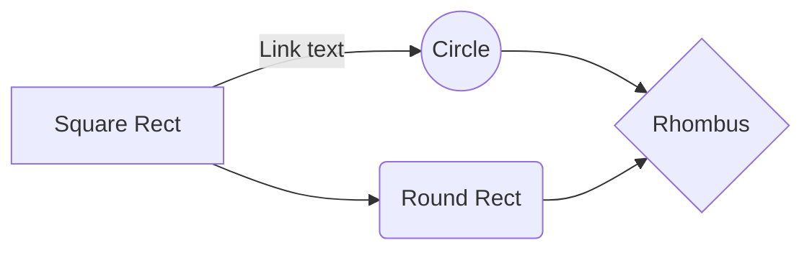

## Treshhold
Jeg fandt det ikke nødvendigt at bruge cvThreshold, da det vil gøre programmet endnu langsommere, og jeg kunne gøre det manualt, bare tilføje til count, hvis intensity er højere end jeg tillader. 
- bare en ekstra skridt
## TODO 
- Captures movement:
	1. Save
	2. Sleep(5) to next scannning  ( or make loop to check if 5 seconds is went from the last movement
## time.h
```C
#include <stdio.h>
#include <time.h>

void main(){
	time_t rawtime;
	struct tm * timeinfo;

	time(&rawtime);
	timeinfo = localtime (&rawtime);

	printf("Curr local time: %s", asctime(timeinfo));
	//char * time = __TIME__;
	//printf("%s", __TIME__);
}
```
https://www.tutorialspoint.com/c_standard_library/time_h.htm
## Questions 
- Er det menning at selvom der blev taget to billede lige efter hinannden uden at der var bevægelse, at der ikke er éns billeder.
Dvs. Når jeg laver cvAbsDiff og tjekker intensities, så alle mere er end nul. Så skal jeg selv vurdere hvor meget skal jeg ignorere? 
Dvs. hvis intensity mere end 50, så skal jeg betragte som forskel.  
	- Det vil jo være næsten umuligt i skoven, da alt ændre sig. Blader, belysninger., camera bevægelser osv.
- Er det okey, at jeg convereterer absDiff til gray billede?
## Issues

